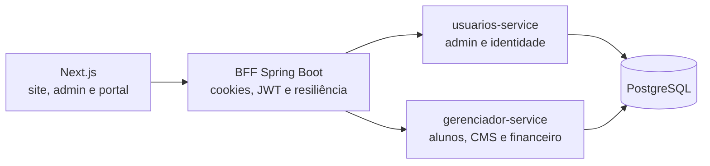

# RockerPilates

Sistema de gestão para estúdio de pilates construído com **Java 21**, **Spring Boot**, **PostgreSQL**, **Next.js** e **Docker**.

> Portfolio preview: o projeto está em homologação e ainda não deve ser tratado como pronto para produção com dados reais.

## O problema

Pequenos estúdios precisam acompanhar alunos, planos, vencimentos e conteúdo do site sem perder o controle humano sobre decisões financeiras. O RockerPilates centraliza essa operação em uma aplicação com painel administrativo e portal do aluno.

## A solução

- cadastro, consulta e manutenção de alunos;
- gestão manual de assinaturas e pagamentos;
- histórico financeiro e dashboard administrativo;
- autenticação separada para administração e alunos;
- CMS básico para conteúdo e depoimentos;
- proteção de sessão, rate limit, headers de segurança e fallbacks entre serviços.

## Demonstração anonimizada

As imagens e o vídeo do case serão publicados somente com dados fictícios. O roteiro e os critérios de anonimização estão em [`docs/portfolio/README.md`](docs/portfolio/README.md).

Uma instância pública ainda não está disponível porque HTTPS, backup/restauração e o checklist de produção precisam ser validados primeiro.

## Arquitetura



O repositório é um monorepo com três módulos backend:

- `bff-pilates`: ponto de entrada, autenticação por cookie, rate limit e integração via OpenFeign;
- `usuarios-service`: identidade administrativa com Spring Security;
- `gerenciador-service`: regras de alunos, assinaturas, pagamentos, CMS e Flyway.

### Decisões de engenharia

**BFF como fronteira externa.** O frontend não acessa os serviços internos diretamente. Autenticação, cookies, tratamento de falhas e composição das respostas ficam centralizados no BFF.

**Financeiro assistido, não automático.** O sistema registra, calcula e alerta; a responsável pelo estúdio confirma pagamentos e cancelamentos. Essa escolha evita decisões financeiras irreversíveis sem intervenção humana.

**Identidades separadas.** Administração e alunos usam fluxos, tokens e cookies distintos. A troca ou redefinição de senha incrementa a versão da sessão e invalida tokens antigos.

## Backend em destaque

- Java 21 e Spring Boot 3;
- Spring Security, JWT e cookies `HttpOnly`;
- PostgreSQL, Spring Data JPA e Flyway;
- OpenFeign, Resilience4j e circuit breakers;
- Bucket4j para rate limit de login;
- Docker Compose para o ambiente completo;
- tratamento centralizado de erros e validação de uploads.

O frontend utiliza Next.js, React, TypeScript e Tailwind CSS para apresentar os fluxos administrativos e do aluno.

## Executar localmente

### Pré-requisitos

- Docker com Docker Compose;
- portas `3000`, `5432`, `8080`, `8081` e `8082` disponíveis.

### Configuração

Crie o arquivo local de ambiente a partir do modelo:

```bash
cp .env.example .env
```

No PowerShell:

```powershell
Copy-Item .env.example .env
```

Troque todos os valores iniciados por `troque-`. O Compose interrompe a inicialização se senha, JWT ou token interno obrigatório não estiver configurado.

### Subir a aplicação

```bash
docker compose up --build
```

Serviços locais:

| Componente | URL |
| --- | --- |
| Frontend | `http://localhost:3000` |
| BFF | `http://localhost:8080` |
| Usuários | `http://localhost:8081` |
| Gerenciador | `http://localhost:8082` |

## Qualidade

Os pull requests executam automaticamente:

```bash
./gradlew clean test jacocoTestReport jacocoTestCoverageVerification
npm ci
npm run lint
npm run build
```

O pipeline também executa CodeQL e varredura de secrets. Os primeiros testes automatizados cobrem regras financeiras, invalidação de sessão e rate limit; o roadmap mantém a ampliação da cobertura como trabalho explícito.

## Segurança

O projeto inclui cookies `HttpOnly`, CORS configurável, headers HTTP, rate limit, invalidação de sessão, token interno entre serviços e validação de upload. Secrets não possuem fallback versionado e devem ser fornecidos por `.env` ou pelo mecanismo do ambiente.

O estado e os bloqueadores para produção estão documentados em [`docs/seguranca-producao.md`](docs/seguranca-producao.md). Não use dados reais antes de concluir HTTPS, firewall, backup/restauração e homologação.

## Limitações conhecidas

- ainda não existe ambiente público de demonstração;
- cobertura automatizada está sendo ampliada;
- observabilidade estruturada e `correlationId` permanecem no roadmap;
- storage de mídia é local e exige estratégia de backup.

## Roadmap

- ampliar testes unitários e de integração com PostgreSQL;
- validar backup e restauração em ambiente limpo;
- adicionar logs estruturados e rastreabilidade entre serviços;
- concluir deploy seguro com HTTPS e dados fictícios;
- publicar vídeo curto do fluxo completo.

## Autor

Desenvolvido por **Jhonathan Dominick**, desenvolvedor backend Java.

[LinkedIn](https://linkedin.com/in/jhonathan-dominick-013a36326) · [GitHub](https://github.com/JhonathanDominick)

