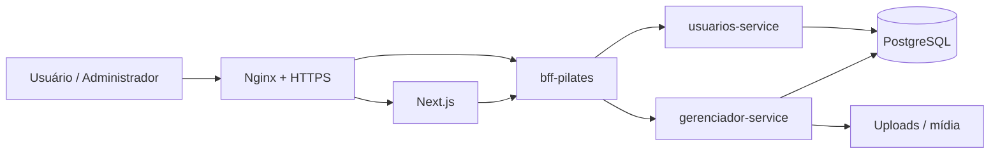

# RockerPilates

[](https://rockerpilates.com)
[](https://github.com/JhonathanDominick/rockepilates/actions/workflows/quality.yml)
[](https://github.com/JhonathanDominick/rockepilates/actions/workflows/codeql.yml)
[](https://github.com/JhonathanDominick/rockepilates/actions/workflows/secrets.yml)

**Aplicação full stack real desenvolvida para um estúdio de Pilates, com V1 em produção.**

O RockerPilates combina site institucional, painel administrativo, CMS, autenticação, persistência de dados e infraestrutura de produção em uma arquitetura baseada em **Java 21, Spring Boot, PostgreSQL, Next.js e Docker**.

**Produção:** [https://rockerpilates.com](https://rockerpilates.com)

> Este é um projeto real. O repositório documenta arquitetura, decisões de engenharia e evolução do produto sem versionar credenciais, dados reais da cliente ou informações operacionais sensíveis.

---

## Visão geral

| Área | Tecnologia / abordagem |
| --- | --- |
| Status | **V1 em produção** |
| Backend | Java 21, Spring Boot 3, Spring Security |
| Frontend | Next.js, React, TypeScript, Tailwind CSS |
| Arquitetura | BFF + serviços especializados |
| Banco de dados | PostgreSQL + Spring Data JPA + Flyway |
| Autenticação | JWT + cookies HttpOnly |
| Resiliência | OpenFeign + Resilience4j |
| Segurança | BCrypt, rate limit, CORS, CSP, headers HTTP |
| Infraestrutura | Docker Compose, Nginx, HTTPS |
| Qualidade | Gradle, JaCoCo, ESLint, CodeQL, Gitleaks |
| Produção | VPS Linux com serviços internos isolados |

---

## O problema

Um estúdio de Pilates precisa manter presença digital, atualizar conteúdo do site e organizar sua operação sem depender de alterações manuais no código para cada mudança de informação.

Ao mesmo tempo, funcionalidades administrativas e dados internos não devem ficar diretamente expostos na aplicação pública.

O RockerPilates foi desenvolvido para centralizar essas necessidades em uma aplicação única, mantendo separação entre:

- experiência pública;
- administração do conteúdo;
- autenticação;
- regras de negócio;
- persistência;
- infraestrutura.

---

## V1 em produção

A primeira versão entregue concentra o escopo necessário para a presença digital e administração do conteúdo do estúdio.

### Site público

- landing page responsiva;
- apresentação do estúdio e da profissional;
- benefícios e modalidades;
- planos;
- chamadas para ação;
- integração com serviços externos;
- área de depoimentos;
- conteúdo administrável sem alteração de código.

### Painel administrativo

- autenticação administrativa;
- sessão baseada em cookie `HttpOnly`;
- CMS para textos, imagens, vídeos e links;
- upload de mídia;
- moderação de depoimentos;
- edição das principais informações exibidas no site.

### Infraestrutura

- aplicação containerizada;
- reverse proxy com Nginx;
- HTTPS;
- banco PostgreSQL persistente;
- serviços internos sem exposição pública direta;
- scripts de deploy, backup, restauração e validação.

---

## Evolução do produto

O repositório também contém a base de funcionalidades que fazem parte da evolução do RockerPilates, mas que **não pertencem ao escopo público da V1 atualmente em produção**.

Entre elas:

- cadastro e manutenção de alunos;
- assinaturas;
- controle de pagamentos;
- histórico financeiro;
- dashboard administrativo;
- portal do aluno;
- autenticação específica para alunos;
- fluxos financeiros assistidos.

A arquitetura da V1 possui controles para manter esses módulos fora da superfície pública enquanto continuam sendo evoluídos.

Essa separação permite entregar valor em produção sem expor funcionalidades que ainda pertencem a fases posteriores do produto.

---

## Arquitetura


```mermaid
flowchart LR
    USER["Usuário / Administrador"] --> NGINX["Nginx + HTTPS"]

    NGINX --> WEB["Next.js"]
    NGINX --> BFF["bff-pilates"]

    WEB --> BFF

    BFF --> USR["usuarios-service"]
    BFF --> GER["gerenciador-service"]

    USR --> PG[(PostgreSQL)]
    GER --> PG

    GER --> MEDIA["Uploads / mídia"]
```

### Frontend

O frontend é responsável pela experiência do site público e pelas interfaces administrativas.

Ele não acessa diretamente os serviços internos de negócio. As chamadas passam pelo **Backend for Frontend (BFF)**.

### `bff-pilates`

Funciona como fronteira externa do backend e concentra responsabilidades como:

- autenticação por cookies;
- integração com os serviços internos;
- rate limit de login;
- validação de acesso;
- composição de respostas;
- tratamento de falhas;
- aplicação de controles da V1.

### `usuarios-service`

Responsável pela identidade administrativa:

- usuários;
- autenticação;
- BCrypt;
- Spring Security;
- emissão de JWT;
- autorização.

### `gerenciador-service`

Concentra regras relacionadas ao domínio da aplicação:

- CMS;
- configurações do site;
- uploads;
- depoimentos;
- alunos;
- assinaturas;
- pagamentos;
- regras financeiras.

---

## Stack técnica

### Backend

- Java 21
- Spring Boot
- Spring Security
- Spring Data JPA
- Jakarta Validation
- PostgreSQL
- Flyway
- OpenFeign
- Resilience4j
- Bucket4j
- JJWT
- Gradle
- JaCoCo

### Frontend

- Next.js
- React
- TypeScript
- Tailwind CSS
- ESLint
- Recharts
- Lucide React

### Infraestrutura

- Docker
- Docker Compose
- Nginx
- HTTPS
- Certbot
- Ubuntu Server
- UFW
- fail2ban

### Qualidade e segurança

- GitHub Actions
- testes automatizados
- lint e build obrigatório
- JaCoCo
- CodeQL
- Gitleaks
- Dependabot
- branch protection

---

## Decisões de engenharia

### Backend for Frontend como fronteira

O frontend não acessa diretamente `usuarios-service` ou `gerenciador-service`.

O `bff-pilates` funciona como ponto de entrada e mantém autenticação, cookies, políticas de acesso e integração entre serviços centralizados.

Essa decisão reduz o acoplamento do frontend com os serviços internos e diminui a superfície pública da aplicação.

### Separação entre V1 e funcionalidades futuras

A aplicação possui um modo específico para a V1.

Rotas e APIs que pertencem a módulos futuros podem permanecer no código sem ficar disponíveis publicamente na versão atualmente implantada.

Isso permite evolução incremental do produto sem obrigar a remoção de funcionalidades em desenvolvimento.

### Identidades administrativas e de alunos separadas

Os fluxos de autenticação foram projetados separadamente para administração e alunos, utilizando tokens e cookies distintos.

Essa separação reduz ambiguidades de autorização entre perfis com responsabilidades diferentes.

### Financeiro assistido

O sistema foi projetado para registrar e organizar pagamentos sem tomar automaticamente decisões financeiras irreversíveis.

A confirmação de pagamentos e operações sensíveis continua sob controle humano.

### Migrations versionadas

Alterações no banco utilizam Flyway, evitando depender de alterações manuais de schema durante a evolução do produto.

---

## Segurança

O projeto aplica múltiplas camadas de proteção.

### Autenticação e senhas

- senhas armazenadas com BCrypt;
- JWT com expiração;
- cookies `HttpOnly`;
- `SameSite=Lax`;
- cookies `Secure` em produção;
- fluxos distintos para administração e alunos.

### Proteção HTTP

O BFF adiciona headers como:

- `X-Content-Type-Options`;
- `X-Frame-Options`;
- `Referrer-Policy`;
- `Permissions-Policy`;
- `Content-Security-Policy`;
- `Strict-Transport-Security` quando habilitado.

### Proteção de login

Tentativas de autenticação possuem rate limit com Bucket4j.

### Comunicação interna

Serviços internos não precisam ser expostos diretamente à Internet.

A comunicação entre componentes permanece dentro da rede da aplicação e inclui autenticação interna onde necessário.

### Secrets

Credenciais reais não são versionadas.

Arquivos `.env`, dumps de banco, uploads e backups ficam fora do Git, enquanto arquivos de exemplo utilizam placeholders.

---

## Produção

A V1 é executada em uma VPS Linux utilizando Docker Compose.

A topologia de produção mantém:

```text
Internet
   │
   ▼
Nginx / HTTPS
   │
   ├── Next.js
   │
   └── BFF
         │
         ├── usuarios-service
         ├── gerenciador-service
         └── PostgreSQL
```

Frontend e BFF são publicados apenas em interfaces locais da VPS e acessados externamente através do Nginx.

PostgreSQL e serviços internos não possuem necessidade de exposição pública direta.

O repositório inclui scripts para:

- preparação da VPS;
- geração segura das variáveis de ambiente;
- deploy;
- configuração do Nginx e HTTPS;
- ativação de HSTS;
- validação da aplicação;
- backup;
- restauração.

---

## Backup e recuperação

A estratégia de backup contempla:

- banco de usuários;
- banco do gerenciador;
- uploads;
- checksums SHA-256;
- retenção configurável.

O processo de restauração possui confirmação explícita antes de operações destrutivas e gera um backup preventivo antes de substituir dados.

A validação periódica de restauração em ambiente separado permanece como atividade operacional importante.

---

## CI e qualidade

Pull requests passam por verificações automatizadas antes de serem integrados à branch principal.

### Backend

```bash
./gradlew clean test jacocoTestReport jacocoTestCoverageVerification
```

### Frontend

```bash
npm ci
npm run lint
npm run build
```

Além dos testes e builds, o repositório utiliza:

- CodeQL para análise estática de segurança;
- Gitleaks para detecção de secrets;
- Dependabot para manutenção de dependências;
- branch protection na `main`.

A cobertura automatizada continua sendo ampliada conforme novos fluxos do sistema evoluem.

---

## Estrutura do repositório

```text
rockepilates/
├── backend/
│   ├── bff-pilates/
│   ├── usuarios-service/
│   └── gerenciador-service/
│
├── frontend/
│   └── rockepilates-web/
│
├── deploy/
│   ├── nginx/
│   └── scripts/
│
├── docs/
│
├── docker-compose.yml
├── docker-compose.prod.yml
├── build.gradle.kts
└── README.md
```

---

## Executar localmente

### Pré-requisitos

- Docker
- Docker Compose

Crie o arquivo de ambiente:

```bash
cp .env.example .env
```

No PowerShell:

```powershell
Copy-Item .env.example .env
```

Substitua os placeholders pelas configurações locais necessárias.

Depois execute:

```bash
docker compose up --build
```

No ambiente de desenvolvimento, os principais serviços ficam disponíveis em:

| Componente | Endereço |
| --- | --- |
| Frontend | `http://localhost:3000` |
| BFF | `http://localhost:8080` |
| usuarios-service | `http://localhost:8081` |
| gerenciador-service | `http://localhost:8082` |

---

## Próximas evoluções

Com a V1 já em produção, a evolução técnica do projeto está concentrada principalmente em:

- ampliação dos testes unitários e de integração;
- observabilidade e rastreabilidade entre serviços;
- validação periódica do processo de restauração;
- hardening adicional de autenticação e sessões;
- evolução dos módulos de alunos, assinaturas e financeiro;
- expansão controlada das funcionalidades administrativas.

O objetivo é evoluir o produto sem comprometer a estabilidade da versão que já está em produção.

---

## Privacidade

Por se tratar de um projeto real, materiais públicos do repositório não devem expor:

- credenciais;
- dados pessoais de alunos;
- informações privadas da cliente;
- secrets;
- conteúdo operacional sensível.

Exemplos, screenshots e demonstrações destinadas a portfólio devem utilizar dados fictícios ou anonimizados.

---

## Autor

Desenvolvido por **Jhonathan Dominick**, desenvolvedor de software com foco em backend Java.

[LinkedIn](https://linkedin.com/in/jhonathan-dominick-013a36326) · [GitHub](https://github.com/JhonathanDominick)

---

**RockerPilates — V1 em produção e produto em evolução contínua.**